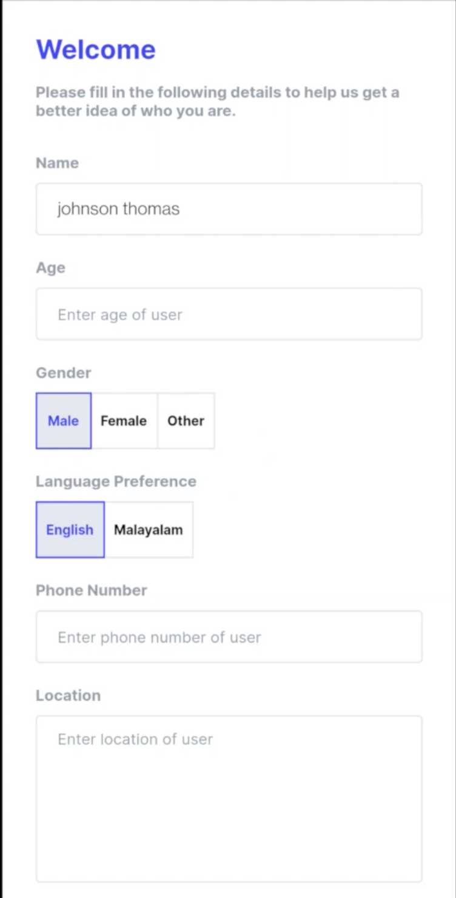
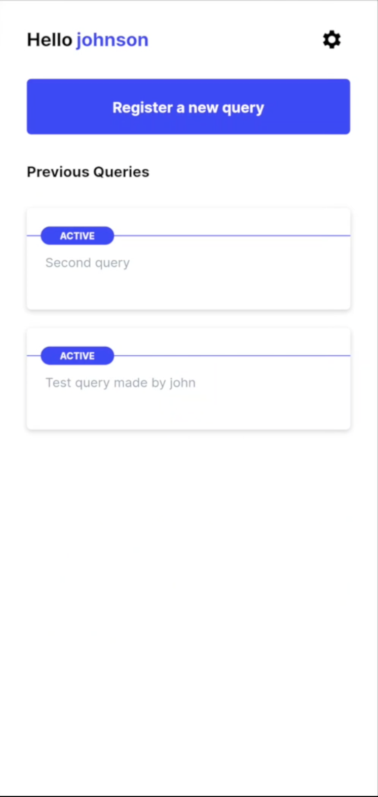
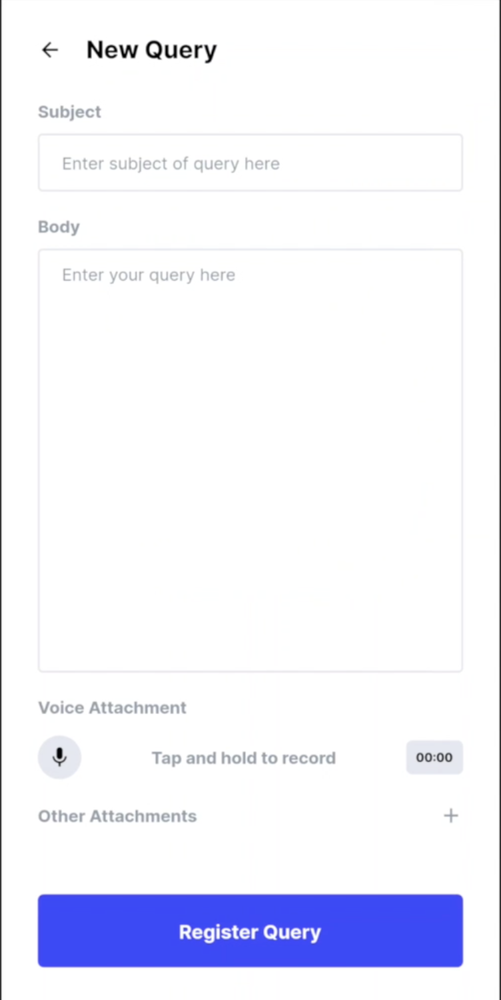
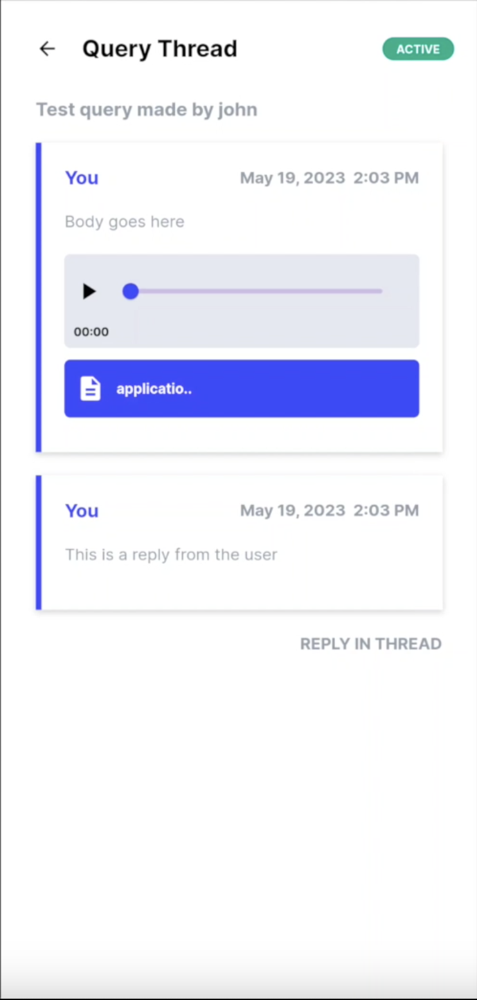

# CLIJEO (Public App)

CLIJEO is a portal for the individuals to reach out to professionals for clarification of legal queries. The app supports the following
1. User registration (via Google)
2. Registring legal queries with support for text, voice and video/photo attachments.
3. Discuss queries with admins via a dedicated chat interface.

The App is built in flutter using the MVC architecture. The UI is responsive and has multi-lingual support (english and malayalam). A truncated version of the directory structure is as follows
```
.
├── README.md
├── analysis_options.yaml
├── android
├── assets
├── fonts
├── ios
├── lang
│   ├── en.json
│   └── ml.json
├── lib
│   ├── config.dart
│   ├── constants.dart
│   ├── main.dart
│   ├── controllers
│   │   ├── clijeo_user
│   │   ├── edit_settings_form
│   │   ├── first_login_form
│   │   ├── main_app
│   │   ├── new_query
│   │   │   ├── audio_playback
│   │   │   └── recording
│   │   ├── query_thread
│   │   │   └── query_thread_attachment
│   │   ├── thread_respond_from
│   │   └── core
│   │       ├── api_core
│   │       ├── auth
│   │       ├── error
│   │       ├── file
│   │       ├── form_validation
│   │       ├── language
│   │       ├── notification
│   │       └── shared_pref
│   ├── models
│   │   ├── attachment
│   │   ├── query
│   │   │   ├── admin_details
│   │   │   ├── media
│   │   │   └── query_response
│   │   ├── sign_in_response
│   │   ├── user
│   │   │   └── query
│   │   └── user_dto
│   └── view
│       ├── core
│       │   ├── common_components
│       │   ├── theme
│       ├── error
│       │   └── widgets
│       ├── first_login_form
│       ├── home
│       │   └── components
│       ├── loading
│       ├── new_query
│       │   └── components
│       ├── query_thread
│       │   └── components
│       ├── settings
│       ├── sign_in
│       └── splash_screen
├── pubspec.lock
└── pubspec.yaml
```

## Screenshots



## Resources
1. [Multilingual Support](https://medium.com/flutter-community/flutter-internationalization-the-easy-way-using-provider-and-json-c47caa4212b2)
2. [UI Responsiveness](https://medium.com/flutter-community/flutter-effectively-scale-ui-according-to-different-screen-sizes-2cb7c115ea0a)
3. [Flutter State Management](https://docs.flutter.dev/development/data-and-backend/state-mgmt/simple) ([ref](https://medium.com/flutter-community/making-sense-all-of-those-flutter-providers-e842e18f45dd), [ref](https://codewithandrea.com/videos/flutter-state-management-setstate-freezed-state-notifier-provider/))
4. [Google Sign-in](https://medium.com/swlh/google-sign-in-with-auto-login-in-flutter-93281747bed4)
